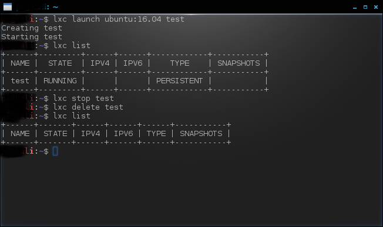

# Building linux snaps with Snapcraft

## Installing Snapcraft

### KALI Linux on Raspberry PI 3

In order to run Snapcraft, it's a good idea install first snapd.

#### Install SNAPD

```bash
sudo apt update
sudo apt install snapd
```

if you plan to use sound system, install also pulseaudio.

```bash
sudo apt install pulseaudio
```

#### Get Snapcraft

Get snapcraft and isntall using snapd system

```bash
snap install snapcraft --classic
```

and confirm version

```bash
snapcraft --version
```

#### Linux Containers

LXD is a next generation system container manager. It offers a user experience similar to virtual machines but using Linux containers instead.

https://linuxcontainers.org/lxd/introduction/

##### Setup LXD

The best way of preserving compatibility with linux versions is compiling using containers. This is why we need to install LXD.

```bash
sudo snap install lxd
```

LXD requires that your user is in the lxd group

```bash
sudo usermod -aG lxd ${USER}
newgrp lxd
```

##### Configure LXD

Configuration of the LXD defaults can be done via the `init` option. Typically accepting the default prompts is sufficient to get a working LXD configuration, usable by snapcraft on the same host

```bash
lxd init
```

Test that LXD (and the lxc client) are correctly installed by starting a container

```bash
lxc launch ubuntu:16.04 test
```

If everything is ok, you should see a container named tes when listing containers

```bash
lxc list
```

and then you can stop and delete test container.

```bash
lxc stop test
lxc delete test
```



##### Test a container build

Following docs available in snapcraft.io, we could test that everything is setup correctly with a few commands in a new directory

```bash
mkdir test-snapcraft
cd test-snapcraft
snapcraft init
```

and then,

```bash
snapcraft cleanbuild
```

however, this ended with an error:


this is because we are running lxd unprivilege. 

##### Making it work

As a work arround for this situatio, we made a script that creates the container in privilege mode and run snapcraft.

Bash script **build_snapcraft.sh**:

```bash
##############################
# Terminal Color Codes
##############################

# Reset
Color_Off='\033[0m'       # Text Reset

# Regular Colors
Red='\033[0;31m'          # Red
Yellow='\033[0;33m'       # Yellow
Cyan='\033[0;36m'         # Cyan
White='\033[0;37m'        # White

# Bold
BRed='\033[1;31m'         # Red
BYellow='\033[1;33m'      # Yellow
BCyan='\033[1;36m'        # Cyan
BWhite='\033[1;37m'       # White

# Background
On_Black='\033[40m'       # Black
On_Red='\033[41m'         # Red
On_Yellow='\033[43m'      # Yellow
On_Cyan='\033[46m'        # Cyan
On_White='\033[47m'       # White

#######################
# Vars
#######################

SNAPPY_PROJECTS=/home/$USER

if [ -z "$1" ]; then
    echo -e "${BRed}Error: ${Yellow}1 Argument missing. Snap project folder is mandatory. $Color_Off"
    exit
fi

PROJECT_FOLDER=$1

######################
# Main
######################

echo -e "$Cyan"
echo -e "-------------------------------------------------"
echo -e ""
echo -e " Building ${Yellow}$PROJECT_FOLDER $Cyan"
echo -e " Snappy Projects Home: ${Yellow}$SNAPPY_PROJECTS $Cyan"
echo -e ""
echo -e "------------------------------------------------- $Color_Off"

echo -e "${BYellow}Start snaping... $Color_Off"
lxc launch ubuntu:16.04 snapcraft -c security.privileged=true && \
#lxc config profile set default security.privileged true
lxc config device add snapcraft homedir disk source=$SNAPPY_PROJECTS path=/home/ubuntu && \
echo -e "${Yellow}Please wait while container is starting. This action can take 1 or 2 minutes. $Color_Off"
sleep 20
lxc exec snapcraft -- snap install snapcraft --classic >/dev/null 2>&1
echo -e "${Yellow}Installing and configuring tools ... $Color_Off"
lxc exec snapcraft -- snap install snapcraft --classic && \
lxc exec snapcraft -- sh -c "cd /home/ubuntu/$PROJECT_FOLDER; snapcraft" && \
echo -e "${Yellow}Cleaning lxd.. $Color_Off"
lxc stop snapcraft && \
lxc delete snapcraft && \
echo -e "${BYellow}Done! $Color_Off"

```

and that's it. 

#### Building your first snap

Just make it executable and run it with the snap project folder as parameter like this:

```bash
./build_snap.sh test_snap
```

here is what you will get


and a new snap was created at test_snap ready to install. if you need to rebuild, it's a good idea cleanin **parts**, **prime** and **stage** folders.

## Bulding a python snap

Before we start building a python snap, we have  create and understand a very basic python package structure. Snapcraft will use this structure later to build your snap. 

### Python Package Structure

To use as an example, I will build a simple python package structure to use as an example. You can find detailed information [here](https://docs.python-guide.org/writing/structure/) . I will also use my github as source repository because snapcraft can use git to download source code.

The package name will be **mqttping**, and for now, it will just print a message on a screen, receiving one paramater. I created a folder in my home dir to work in all my python packages. 

```bash
mkdir ~/python
```

and also create the package folder

```bash
mkdir ~/python/mqttping
```

A basic structure will have 4 files:

**LICENSE** - This file is optional and has the text with the license of our code. You can get more info about open source lincensing [here](https://opensource.org/licenses)

**README.md** - This file is optional and is used by github to give some information about the package and how it works. This is a kind of a manual.

**mqttping.py** - Our python code. This is mandatory :)

**setup.py** - This file has methods related with package installation and entry point for the aplication.Also mandatory.

here is the the structure:


#### Python Code

You can put what ever you want in README.md and LICENSE files, as I said it's optional.

**mqttping** is the main file. Here is the main code of our package.

```python
#!/usr/bin/env python
# coding: utf-8
# References:
# https://opensource.org/licenses

import os
import sys

__version__ = '0.1.1'


def quit(s, code=0):
    if s is not None:
        print(s)
    sys.exit(code)


def print_help():
    help = """
Usage: mqttping <test string>
"""[1:-1]
    print(help)


def main():
    args = sys.argv[1:]
    if not args:
        print_help()
        quit(None, 0)

    print("Hello Python snaped {}".format(args))

if __name__ == '__main__':
    main()


```

**setup.py** is the setup code, as I said before, has information about how this can be installed with python pip tool. Later we will see what changes we must to implement in our snapcraft bash script in order to fullfill all python dependencies requests. Here is the content of setup.py

```python
#!/usr/bin/env python
# coding=utf-8

from setuptools import setup

package_name = 'mqttping'
filename = package_name + '.py'

def get_version():
    import ast
    with open(filename) as input_file:
        for line in input_file:
            if line.startswith('__version__'):
                return ast.parse(line).body[0].value.s

def get_long_description():
    try:
        with open('README.md', 'r') as f:
            return f.read()
    except IOError:
        return ''

setup(
    name=package_name,
    version=get_version(),
    author='Your_name',
    author_email='your_email',
    description='mqtt ping test',
    url='https://github.com/your_git_user/mqttping',
    long_description=get_long_description(),
    py_modules=[package_name],
    entry_points={
        'console_scripts': [
            'mqttping = mqttping:main'
            ]
        },
    license='License :: OSI Approved :: MIT License',
)

```

and we have all code we need. From the command line you can test your python package.

```bash
cd ~/python/mqttping
python mqttping.py test
```

Here is the expected result


#### Hosting at Github

GitHub is a code hosting platform for version control and collaboration. It lets you and others work together on projects from anywhere. I will show only the basic steps to move and maintain this python code on github. You can learn much more [here](https://guides.github.com/).

##### Create a repository

A **repository** is usually used to organize a single project. Repositories can contain folders and files, images, videos, spreadsheets, and data sets – anything your project needs. We recommend including a *README*, or a file with information about your project. GitHub makes it easy to add one at the same time you create your new repository. *It also offers other common options such as a license file.*

To create a repository follow this steps:

1. In the upper right corner, next to your avatar or identicon, click  and then select **New repository**.

2. Name your repository `mqttping`.

3. Write a short description.

   

Click **Create repository** and that's all.

##### Add and maintain your project

To the next steps, you need to install git command line if you don't have it already. You can find how to install it [here](https://git-scm.com/book/en/v2/Getting-Started-Installing-Git).

To add your files, you need to initialize the project folder and only then, you will be able to host all your files. There's how you can do it.

```bash
cd ~/python/mqttpingu
git init
git add README.md LICENSE mqttping.py setup.py
git commit -m "first commit"
git config --global user.email "<your email>"
git config --global user.name "<your git username>"
git remote add origin https://github.com/<your_git>/mqttping.git
git push -u origin master
```

you will need to provide your git **username** and **password** if asked.

every time you change files,  you will need to commit changes and add the files again. For instance, if you make any change to mqttping.py, you will need to do the following:

```bash
git add mqttping.py
git commit -m "your comment to the change"
git push
```

### Building Snap

To build mqttping snap, we need to use snapcraft and the the bash script  we created before in this tutorial. Because we are going to build a python snap and snapcraft uses pip to install python app on lxd container, we need to include an instruction to install pip on lxc after installing snapcraft. This is done by adding *lxc exec snapcraft -- sh -c "apt update && apt install python-pip -y" && \\*  to build_snap.sh. 

```bash
##############################
# Terminal Color Codes
##############################

# Reset
Color_Off='\033[0m'       # Text Reset

# Regular Colors
Red='\033[0;31m'          # Red
Yellow='\033[0;33m'       # Yellow
Cyan='\033[0;36m'         # Cyan
White='\033[0;37m'        # White

# Bold
BRed='\033[1;31m'         # Red
BYellow='\033[1;33m'      # Yellow
BCyan='\033[1;36m'        # Cyan
BWhite='\033[1;37m'       # White

# Background
On_Black='\033[40m'       # Black
On_Red='\033[41m'         # Red
On_Yellow='\033[43m'      # Yellow
On_Cyan='\033[46m'        # Cyan
On_White='\033[47m'       # White

#######################
# Vars
#######################

SNAPPY_PROJECTS=/home/$USER

if [ -z "$1" ]; then
    echo -e "${BRed}Error: ${Yellow}1 Argument missing. Snap project folder is mandatory. $Color_Off"
    exit
fi

PROJECT_FOLDER=$1

######################
# Main
######################

echo -e "$Cyan"
echo -e "-------------------------------------------------"
echo -e ""
echo -e " Building ${Yellow}$PROJECT_FOLDER $Cyan"
echo -e " Snappy Projects Home: ${Yellow}$SNAPPY_PROJECTS $Cyan"
echo -e ""
echo -e "------------------------------------------------- $Color_Off"

echo -e "${BYellow}Start snaping... $Color_Off"
lxc launch ubuntu:16.04 snapcraft -c security.privileged=true && \
lxc config device add snapcraft homedir disk source=$SNAPPY_PROJECTS path=/home/ubuntu && \
echo -e "${Yellow}Please wait while container is starting. This action can take 1 or 2 minutes. $Color_Off"
sleep 20
lxc exec snapcraft -- snap install snapcraft --classic >/dev/null 2>&1
echo -e "${Yellow}Installing and configuring tools ... $Color_Off"
lxc exec snapcraft -- snap install snapcraft --classic && \
## For python packages
## to install pip in this container
lxc exec snapcraft -- sh -c "apt update && apt install python-pip -y" && \
## end python
lxc exec snapcraft -- sh -c "cd /home/ubuntu/$PROJECT_FOLDER; snapcraft" && \
echo -e "${Yellow}Cleaning lxd.. $Color_Off"
lxc stop snapcraft && \
lxc delete snapcraft && \
echo -e "${BYellow}Done! $Color_Off"
```

#### Setup a snap project

Now, it's time to create our snap project and setup configuration file (yaml file) to include mqttping python app.

##### Initialize project

```bash
cd ~
mkdir mqttping-snap
cd ~/mqttping-snap
snapcraft init
```

##### Setup snapcraft.yaml 

Edit *snapcraft.yaml* located in *~/mqttping-snap/snap* to look like the following:

```yaml
name: mqttping # you probably want to 'snapcraft register <name>'
version: '0.1' # just for humans, typically '1.2+git' or '1.3.2'
summary: Single-line elevator pitch for your amazing snap # 79 char long summary
description: |
  This is my-snap's description. You have a paragraph or two to tell the
  most important story about your snap. Keep it under 100 words though,
  we live in tweetspace and your description wants to look good in the snap
  store.

grade: stable # must be 'stable' to release into candidate/stable channels
confinement: devmode # use 'strict' once you have the right plugs and slots

parts:
  mqttping:
    source: https://github.com/your_github_user/mqttping.git
    # See 'snapcraft plugins'
    plugin: python
    python-version: python2

apps:
  mqttping:
    command: mqttping

```

Important paramaters to change or include:

**name:** The name of your project. In this case *mqttping*

**parts:** Remove *nill* and insert *mqttping:* part like this:

```yaml
parts:
  mqttping:
    source: https://github.com/your_github_user/mqttping.git
    # See 'snapcraft plugins'
    plugin: python
    python-version: python2
```

**source:** The github link to your repo

**plugin:** This is a python app, isn't it? so .. *python*

**python-version:** By default, snapcraft use python3. If you need to force to use python 2, this is the right place.

**apps:** Insert this parameter to name and install your app like this

```yaml
apps:
  mqttping:
    command: mqttping
```

and it's all set.

#### Build your snap

to build your snap, just run the *build_snap.sh*

```bash
cd ~
./build_snap.sh mqttping-snap
```


